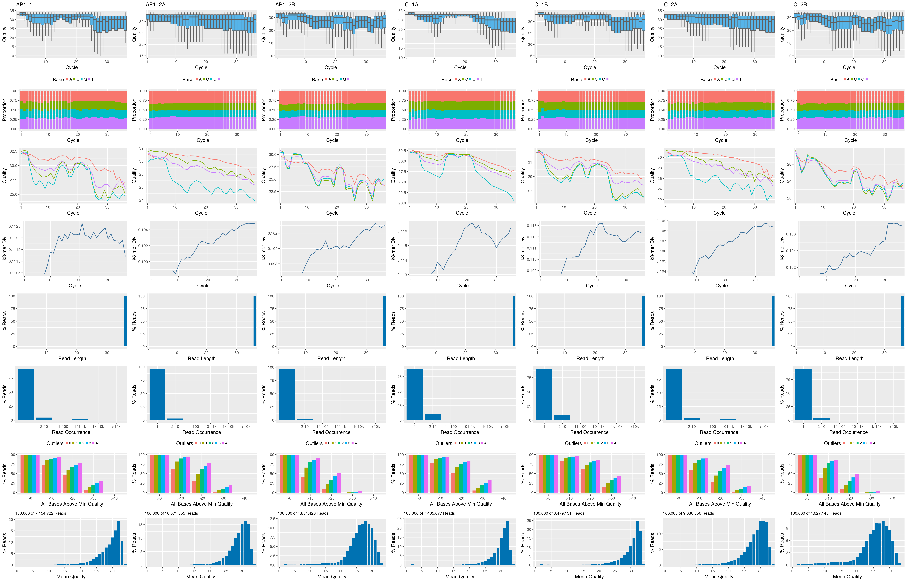
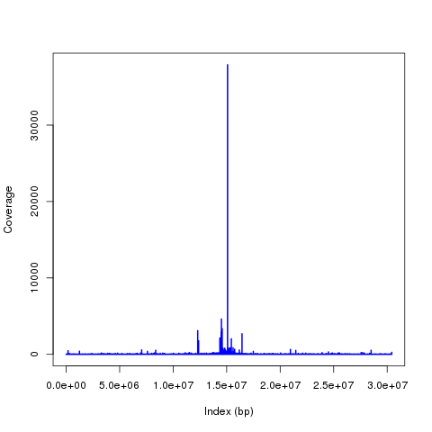
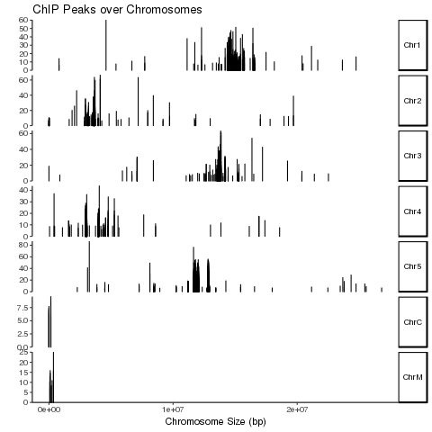
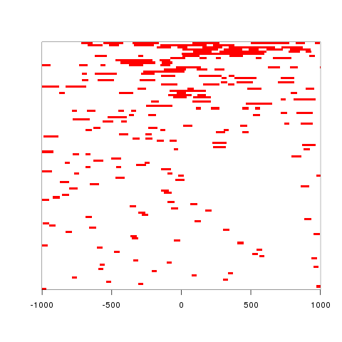
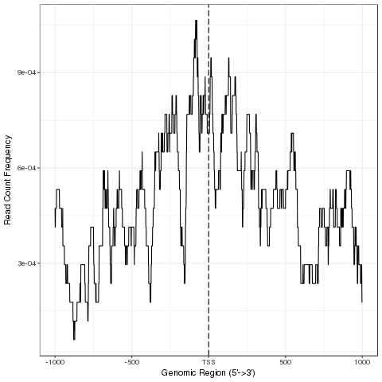
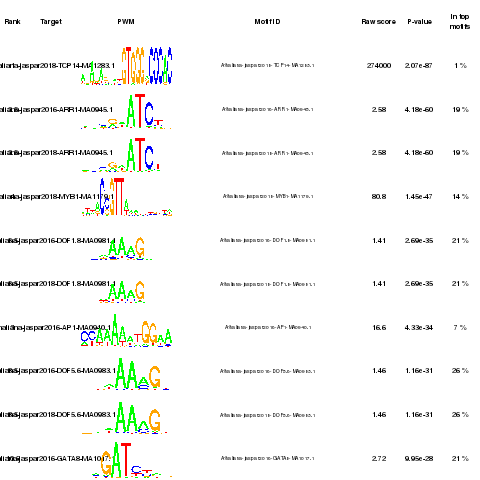
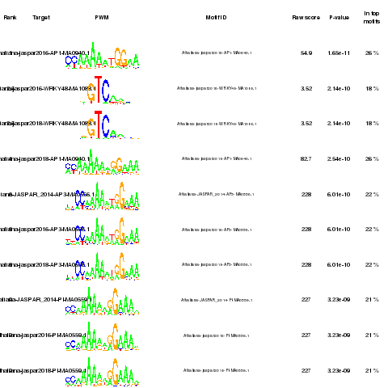
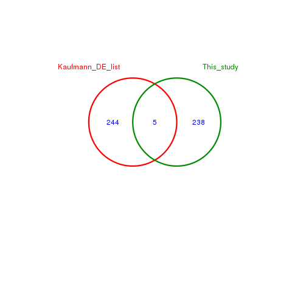
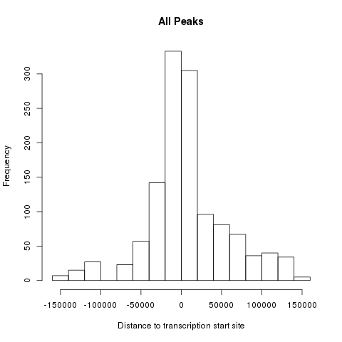

<!--
- Render from R
rmarkdown::render('ChIPSeq2_arafat_report.Rmd',output_file='report_arafat.html', c('html_document'), clean=F, output_options =list())
-->

<script type="text/javascript">
document.addEventListener("DOMContentLoaded", function() {
  document.querySelector("h1").className = "title";
});
</script>
<script type="text/javascript">
document.addEventListener("DOMContentLoaded", function() {
  var links = document.links;  
  for (var i = 0, linksLength = links.length; i < linksLength; i++)
    if (links[i].hostname != window.location.hostname)
      links[i].target = '_blank';
});
</script>


# Abstract

ChIP-Seq is NGS sequencing of transcription factor binding sites in DNA. This experiment can reveal binding sites of particular protein in the genome, and find potential motifs. ChIP-Seq can help to find how a protein interact with particular genetic pathway by regulating transcription-machinery in the cell. In this work, ChIP-Seq dataset from previously published paper were used for educational-purpose data-analysis. The analysis corroborate with the paper. 


# 1. Introduction

Arabidopsis is a flowering plant that can be bred sexually. This is a good model organism for plant development. It breed quickly and are easy to work with. It's pollination is important, because 75% of world’s leading food crop rely on animal pollination for high yield. AP1 has been shown to suppress other genes that suppress the production of flowers. AP1 regulate suppressors of floral production by MADS-domain transcription factors. Research on Kaufmann et al. 2010 [@kaufmann2010orchestration] paper went into exploring where AP1 binds and whether it upregulates or downregulates the genes that it binds.


Many genes had different transcription levels when AP1 lacks protein biosynthesis-- demonstrating the protein is sufficient to regulate floral development. ap1 mutants demonstrated that the protein is necessary for regulating some high-confidence target genes. It influences transcription factor-coding genes, showing that it regulates transcriptional regulators to ultimately influence floral phenotype. They found that, AP1 preferentially bound prior to the start site of genes that it regulates. AP1 upregulates some genes and downregulates other (mostly it downregulates genes). There are time-differentials in terms of the regulation of genes. AP1 sets up floral meristem identity by suppressing genes that cause the development of shoots.

We have used publication by Kaufmann et al. 2010 paper for our experimental data source [@kaufmann2010orchestration].


# 2. Methods

## 2.1 Experimental design

In the Kaufmann et al. 2010 paper, they have two condigions for ChIP-Seq experiment: pull-down by AP1 specific antibody and control experiment. They have both biological and technical replicates, thereby finally they have seven libraries: three for AP1 treatment and four for control experiments. They parallely also did microarray analysis to record transcriptional change during this modification. 

## 2.2 ChIP Seq Analysis

For our analysis, we have done the following:

* Establish workflow environment
* FastQ quality report
* Use Bowtie2 to map reads to the genome
* Generate BAM files and view them using Integrative Genome Viewer
* Model-based Analsysis for ChIP-Seq 2 (MACS2) for Peak Calling-evaluates the significance of binding regions in ChIP-Seq. 
* Annotating with ChIPseeker package
* Generate count tables
* And challenge project tasks

# 3. Results and Discussion

## 3.1 Generate workflow environment

The workfolw generated by using the starter code from the GitHub project repository. I have used the `git pull` command for initiating local instance in HPCC Biocluster. The workflow requires to load `systemPipeR` package first.


```r
library(systemPipeR)
```


## 3.2 Read preprocessing

For initial analysis, I have filtered data so that there is no read sequence in the fastq file that contain any base with Phred quality less than 20. But, this filtering changes data-set size roughly by 80%, which is great loss of information. In second round of the analysis, I have used unfiltered data with no read preprocessing.

### 3.2.1 Experiment definition provided by `targets` file

The `targets` file defines all FASTQ files and sample comparisons of the analysis workflow. The target file is populated with 'untrimmed' data-set. The target file is shown below.


```r
targets <- read.delim("targets_chip.txt", comment.char = "#")
targets
```

```
##                                                     FileName SampleName Factor       SampleLong
## 1 /bigdata/gen242/shared/ChIP-Seq1/data/SRR038845_1.fastq.gz      AP1_1    AP1 APETALA1 Induced
## 2 /bigdata/gen242/shared/ChIP-Seq1/data/SRR038846_1.fastq.gz     AP1_2A    AP1 APETALA1 Induced
## 3 /bigdata/gen242/shared/ChIP-Seq1/data/SRR038847_1.fastq.gz     AP1_2B    AP1 APETALA1 Induced
## 4 /bigdata/gen242/shared/ChIP-Seq1/data/SRR038848_1.fastq.gz       C_1A      C     Control Mock
## 5 /bigdata/gen242/shared/ChIP-Seq1/data/SRR038849_1.fastq.gz       C_1B      C     Control Mock
## 6 /bigdata/gen242/shared/ChIP-Seq1/data/SRR038850_1.fastq.gz       C_2A      C     Control Mock
## 7 /bigdata/gen242/shared/ChIP-Seq1/data/SRR038851_1.fastq.gz       C_2B      C     Control Mock
##   Experiment      Date SampleReference
## 1          1 23-Mar-12                
## 2          1 23-Mar-12                
## 3          1 23-Mar-12                
## 4          1 23-Mar-12           AP1_1
## 5          1 23-Mar-12           AP1_1
## 6          1 23-Mar-12          AP1_2A
## 7          1 23-Mar-12          AP1_2B
```

### 3.2.2 FASTQ quality report

The following `seeFastq` and `seeFastqPlot` functions generate and plot a series of useful quality
statistics for a set of FASTQ files including per cycle quality box
plots, base proportions, base-level quality trends, relative k-mer
diversity, length and occurrence distribution of reads, number of reads
above quality cutoffs and mean quality distribution. The results are
written to a PDF file named `fastqReport.pdf`.

The report shows overall low quality of the fastq files. As this is one of the first experiment when the NGS sequencing was not matured enough, which explains it's low quality. 


```r
args <- systemArgs(sysma="param/tophat.param", mytargets="targets_chip.txt")
library(BiocParallel); library(BatchJobs)
f <- function(x) {
    library(systemPipeR)
    args <- systemArgs(sysma="param/tophat.param", mytargets="targets_chip.txt")
    seeFastq(fastq=infile1(args)[x], batchsize=100000, klength=8)
}
funs <- makeClusterFunctionsSLURM("slurm.tmpl")
param <- BatchJobsParam(length(args), resources=list(walltime="00:20:00", ntasks=1, ncpus=1, memory="2G"), cluster.functions=funs)
register(param)
fqlist <- bplapply(seq(along=args), f)
#pdf("./results/fastqReport.pdf", height=18, width=4*length(fqlist))
#seeFastqPlot(unlist(fqlist, recursive=FALSE)) 
#dev.off()
png("fastqReport.png", height=18, width=4*length(fqlist), units="in", res=300)
seeFastqPlot(unlist(fqlist, recursive=FALSE))
dev.off()
```


<div>FASTQ quality report for 7 samples</div></br>


## 3.3 Alignments

### 3.3.1 Read mapping with `Bowtie2` 

The original paper used SOAP program. Here, I have run the alignments using `Bowtie2` sequentially on a single system. TAIR10 was used as reference genome to map the reads.


```r
args <- systemArgs(sysma="param/bowtieSE.param", mytargets="targets_chip.txt")
sysargs(args)[1] # Command-line parameters for first FASTQ file
moduleload(modules(args)) # Skip if a module system is not used
system("bowtie2-build ./data/tair10.fasta ./data/tair10.fasta") # Indexes reference genome
runCommandline(args)
```

Check whether all BAM files have been created

```r
file.exists(outpaths(args))
```

### 3.3.2 Read and alignment stats

The following provides an overview of the number of reads in each sample
and how many of them aligned to the reference. The report shows around 70% reads in average were successfully aligned on the reference genome. 


```r
read_statsDF <- alignStats(args=args) 
write.table(read_statsDF, "results/alignStats.xls", row.names=FALSE, quote=FALSE, sep="\t")
```

```r
read.delim("results/alignStats.xls")
```

```
##   FileName   Nreads   Nalign Perc_Aligned Nalign_Primary Perc_Aligned_Primary
## 1    AP1_1  7154722 27204616     380.2330        4530997             63.32876
## 2   AP1_2A 10371555 52034429     501.7033        8056678             77.68052
## 3   AP1_2B  4854426 25040877     515.8360        3798625             78.25076
## 4     C_1A  7405077 29053375     392.3440        5342569             72.14738
## 5     C_1B  3479131 16417721     471.8914        2606219             74.91006
## 6     C_2A  9636656 47365504     491.5139        5454842             56.60513
## 7     C_2B  4627140 28133169     608.0034        3059423             66.11909
```

### 3.3.3 Create symbolic links for viewing BAM files in IGV

Symbolic link to the bam files created so that these can be publically accessible using Internet. The files can be found using this [link:](http://biocluster.ucr.edu/~arahm010/ChIP1_arf/)


```r
symLink2bam(sysargs=args, htmldir=c("~/.html/", "ChIP1_arf/"), 
            urlbase="http://biocluster.ucr.edu/~arahm010/", 
            urlfile="./results/IGVurl.txt```
```


## 3.4 Utilities for coverage data

The following introduces several utilities useful for ChIP-Seq data. They are not part of the actual
workflow.

### 3.4.1 Rle object stores coverage information

Here we created run-length encodoing object to compress coverage information in lossless way.


```r
library(rtracklayer); library(GenomicRanges); library(Rsamtools); library(GenomicAlignments)
aligns <- readGAlignments(outpaths(args)[1])
cov <- coverage(aligns)
cov
```

### 3.4.2 Resizing aligned reads

```r
trim(resize(as(aligns, "GRanges"), width = 200))
```

### 3.4.3 Naive peak calling

```r
islands <- slice(cov, lower = 15)
islands[[1]]
```

### 3.4.4 Plot coverage for defined region

This chunk of code takes a lot of time, and often fails for the whole range. I did not got time to troubleshoot it. 

```r
library(ggbio)
chrLen <- c(length(cov$Chr1), length(cov$Chr2),length(cov$Chr3), length(cov$Chr4), length(cov$Chr5))
chr <- c("Chr1", "Chr2", "Chr3", "Chr4", "Chr5")
i= 'Chr1'
i = "Chr1"
for(i in chr){
   z <- as.character(i)
   z <- paste(z, ".png", sep="")
   png(z)
   q = 1
   myloc <- c(i, 1, chrLen[q])
   a <- readGAlignments(outpaths(args)[1], use.names=TRUE, param=ScanBamParam(which=GRanges(myloc[1], IRanges(as.numeric(myloc[2]), as.numeric(myloc[3])))))
   png(file='Chr_cov.png')
   autoplot(a, aes(color = strand, fill = strand), facets = strand ~ seqnames, stat = "coverage")
   dev.off()
   q <- q+1
 }
```

Instead, I have used following code to get coverage from rle object generated previously.

```r
z <- GRanges("Chr1",IRanges(1,chrLen[1]))
xnum <- as.numeric(cov$Chr1[ranges(z)])
png(file='Chr1.png', res=300)
plot(xnum, type="l", col="blue", lwd=2, xlab='Index (bp)', ylab='Coverage')
dev.off()
```


<div> Coverage summary of chromosome 1</div></br>


## 3.5 Peak calling with MACS2

### 3.5.1 Merge BAM files of replicates prior to peak calling


Merging BAM files of technical and/or biological replicates can improve
the sensitivity of the peak calling by increasing the depth of read
coverage.


```r
args <- systemArgs(sysma=NULL, mytargets="targets_bam.txt")
args_merge <- mergeBamByFactor(args, overwrite=TRUE)
writeTargetsout(x=args_merge, file="targets_mergeBamByFactor.txt", overwrite=TRUE)
```

### 3.5.2 Peak calling without input/reference sample

MACS2 can perform peak calling on ChIP-Seq data with and without input
samples [@Zhang2008-pc]. Here, I have used peak calling without input/reference sample.


```r
args <- systemArgs(sysma="param/macs2_noinput.param", mytargets="targets_mergeBamByFactor.txt")
args <- systemArgs(sysma="param/macs2_noinput.param", mytargets="targets_mergeBamByFactor.txt")
sysargs(args)[1] # Command-line parameters for first FASTQ file
moduleload(module="python", envir=c("PATH", "LD_LIBRARY_PATH", "PYTHONPATH")) # Temp solution due to Python path change
moduleload(module="python")
runCommandline(args)

file.exists(outpaths(args))
writeTargetsout(x=args, file="targets_macs.txt", overwrite=TRUE)
```


The peak calling results from MACS2 are written for each sample to
separate files in the `results` directory. They are named after the corresponding
files with extensions used by MACS2.


### 3.5.3 Identify consensus peaks

The following example shows how one can identify consensus preaks among two peak sets sharing either a minimum absolute overlap and/or
minimum relative overlap using the `subsetByOverlaps` or `olRanges` functions, respectively. Note, the latter is
a custom function imported below by sourcing it.


```r
source("http://faculty.ucr.edu/~tgirke/Documents/R_BioCond/My_R_Scripts/rangeoverlapper.R")
peak_M1A <- outpaths(args)["AP1_1"]
peak_M1A <- as(read.delim(peak_M1A, comment="#")[,1:3], "GRanges")
peak_A1A <- outpaths(args)["C_1A"]
peak_A1A <- as(read.delim(peak_A1A, comment="#")[,1:3], "GRanges")
(myol1 <- subsetByOverlaps(peak_M1A, peak_A1A, minoverlap=1)) # Returns any overlap
myol2 <- olRanges(query=peak_M1A, subject=peak_A1A, output="gr") # Returns any overlap with OL length information
myol2[values(myol2)["OLpercQ"][,1]>=50] # Returns only query peaks with a minimum overlap of 50%
```

## 3.6 Annotate peaks with genomic context

### 3.6.1 Annotation with `ChIPpeakAnno` package

The following annotates the identified peaks with genomic context
information using the `ChIPpeakAnno` and `ChIPseeker` packages, respectively
[@Zhu2010-zo; @Yu2015-xu].


```r
library(ChIPpeakAnno); library(GenomicFeatures)
args <- systemArgs(sysma="param/annotate_peaks.param", mytargets="targets_macs_input.txt")
txdb <- loadDb("./data/TAIR10.sqlite")
#txdb <- makeTxDbFromGFF(file="data/tair10.gff", format="gff", dataSource="TAIR", organism="Arabidopsis thaliana")
#saveDb(txdb, file="./data/TAIR10.sqlite")
ge <- genes(txdb, columns=c("tx_name", "gene_id", "tx_type")) 
for(i in seq(along=args)) {
    peaksGR <- as(read.delim(infile1(args)[i], comment="#"), "GRanges")
    annotatedPeak <- annotatePeakInBatch(peaksGR, AnnotationData=genes(txdb))
    df <- data.frame(as.data.frame(annotatedPeak), as.data.frame(values(ge[values(annotatedPeak)$feature,])))
    write.table(df, outpaths(args[i]), quote=FALSE, row.names=FALSE, sep='\t')
}
writeTargetsout(x=args, file="targets_peakanno.txt", overwrite=TRUE)
```

The peak annotation results are written for each peak set to separate
files in the `results` directory. They are named after the corresponding peak
files with extensions specified in the `annotate_peaks.param` file, 
here `*.peaks.annotated.xls`.

### 3.6.2 Annotation with `ChIPseeker` package

Same as in previous step but using the `ChIPseeker` package for annotating the peaks.


```r
library(ChIPseeker)
for(i in seq(along=args)) {
    peakAnno <- annotatePeak(infile1(args)[i], TxDb=txdb, verbose=FALSE)
    df <- as.data.frame(peakAnno)
    write.table(df, outpaths(args[i]), quote=FALSE, row.names=FALSE, sep="\t")
}
writeTargetsout(x=args, file="targets_peakanno.txt", overwrite=TRUE)
```

Summary plots provided by the `ChIPseeker` package. Here applied only to one sample
for demonstration purposes.


```r
peak <- readPeakFile(infile1(args)[1])
png(file='covplot.png')
covplot(peak, weightCol="X.log10.pvalue.")
dev.off()

png(file='peakHeatMap.png')
peakHeatmap(outpaths(args)[1], TxDb=txdb, upstream=1000, downstream=1000, color="red")
dev.off()

png(file='AvgProf.png')
plotAvgProf2(outpaths(args)[1], TxDb=txdb, upstream=1000, downstream=1000, xlab="Genomic Region (5'->3')", ylab = "Read Count Frequency")
dev.off()
```


<div>ChIP peak distribution over all chromosomes</div></br>


<div>Profile of peaks that align to flank sequences of TSS</div></br>



<div>Peak distribution around TSS</div></br>

## 3.7 Count reads overlapping peaks

Counted number of reads on overlapping peaks. This will be useful in differential binding analysis.


```r
library(GenomicRanges)
args <- systemArgs(sysma="param/count_rangesets.param", mytargets="targets_macs_input.txt")
args_bam <- systemArgs(sysma=NULL, mytargets="targets_bam.txt")
bfl <- BamFileList(outpaths(args_bam), yieldSize=50000, index=character())
countDFnames <- countRangeset(bfl, args, mode="Union", ignore.strand=TRUE)
writeTargetsout(x=args, file="targets_countDF.txt", overwrite=TRUE)
```

## 3.8 Differential binding analysis

Differential binding analysis. It is possible to sort out sequences with low FDR/p-value.


```r
args_diff <- systemArgs(sysma="param/rundiff.param", mytargets="targets_countDF.txt")
cmp <- readComp(file=args_bam, format="matrix") 
dbrlist <- runDiff(args=args_diff, diffFct=run_edgeR, targets=targetsin(args_bam), 
                    cmp=cmp[[1]], independent=TRUE, dbrfilter=c(Fold=0.75, FDR=.1))
writeTargetsout(x=args_diff, file="targets_rundiff.txt", overwrite=TRUE)
```


## 3.9 GO term enrichment analysis

The following performs GO term enrichment analysis for each annotated peak set.

### 3.9.1 Obtain gene-to-GO mappings

Before GO-mapping, it's needed to grab GO terms for our organism and store in a local database.

```r
library("biomaRt")
listMarts() # To choose BioMart database
listMarts(host="plants.ensembl.org")
m <- useMart("plants_mart", host="plants.ensembl.org")
listDatasets(m)
m <- useMart("plants_mart", dataset="athaliana_eg_gene", host="plants.ensembl.org")
listAttributes(m) # Choose data types you want to download
go <- getBM(attributes=c("go_id", "tair_locus", "namespace_1003"), mart=m)
go <- go[go[,3]!="",]; go[,3] <- as.character(go[,3])
go[go[,3]=="molecular_function", 3] <- "F"; go[go[,3]=="biological_process", 3] <- "P"; go[go[,3]=="cellular_component", 3] <- "C"
go[1:4,]
dir.create("./data/GO")
write.table(go, "data/GO/GOannotationsBiomart_mod.txt", quote=FALSE, row.names=FALSE, col.names=FALSE, sep="\t")
catdb <- makeCATdb(myfile="data/GO/GOannotationsBiomart_mod.txt", lib=NULL, org="", colno=c(1,2,3), idconv=NULL)
save(catdb, file="data/GO/catdb.RData")
```

### 3.9.2 Run GO term enrichment analysis

GO-Enrichment

```r
args <- systemArgs(sysma="param/macs2.param", mytargets="targets_bam_ref.txt")
args_anno <- systemArgs(sysma="param/annotate_peaks.param", mytargets="targets_macs_input.txt")
annofiles <- outpaths(args_anno)
gene_ids <- sapply(names(annofiles), function(x) unique(as.character(read.delim(annofiles[x])[,"geneId"])), simplify=FALSE)
load("data/GO/catdb.RData")
BatchResult <- GOCluster_Report(catdb=catdb, setlist=gene_ids, method="all", id_type="gene", CLSZ=2, cutoff=0.9, gocats=c("MF", "BP", "CC"), recordSpecGO=NULL)
```


## 3.10 Motif analysis

### 3.10.1 Parse DNA sequences of peak regions from genome

Enrichment analysis of known DNA binding motifs or _de novo_ discovery
of novel motifs requires the DNA sequences of the identified peak
regions. 


```r
library(Biostrings); library(seqLogo); library(BCRANK)
args <- systemArgs(sysma="param/annotate_peaks.param", mytargets="targets_macs_input.txt")
rangefiles <- infile1(args)
for(i in seq(along=rangefiles)) {
    df <- read.delim(rangefiles[i], comment="#")
    peaks <- as(df, "GRanges")
    names(peaks) <- paste0(as.character(seqnames(peaks)), "_", start(peaks), "-", end(peaks))
    peaks <- peaks[order(values(peaks)$X.log10.pvalue., decreasing=TRUE)]
    pseq <- getSeq(FaFile("./data/tair10.fasta"), peaks)
    names(pseq) <- names(peaks)
    writeXStringSet(pseq, paste0(rangefiles[i], ".fasta")) 
}
```

## 3.11 Challenge Tasks

This part of the report provides my solution to challenge task.

### 3.11.1 Prioritize/rank peaks by FDR from differential binding analysis


```r
diffBind <- read.table("./results/SRR038848_1.fastq_trim.gz_C.bam_macs2_peaks.edgeR.xls") #read edgeR output
diffBind.sorted <- diffBind[order(diffBind$AP1.C_FDR, diffBind$AP1.C_PValue),]
```


### 3.11.2 Parse peak sequences from genome sorted by lowest FDR/p-value

This codeblock ranks sequences from genome by lowest FDR/p-value

```r
peakFile <- 'results/SRR038848_1.fastq_trim.gz_C.bam_macs2_peaks.xls.fasta'
sortedPeaks <-readDNAStringSet(peakFile)[rownames(diffBind.sorted)]
writeXStringSet(sortedPeaks, 'results/sortedPeaks.fasta')
```


### 3.11.3 Enrichment analysis

I use this code for motif enrichment. I needed to compute background frequency of promoter region sequences (1000bp upstream)


```r
library(MotifDb)
library(Biostrings)
library(PWMEnrich)
library(GenomicFeatures)
library(ShortRead)
library(BSgenome)

peak_seq <- readDNAStringSet('results/sortedPeaks.fasta',format='fasta')
athaliana_motifs <- as.list(query(MotifDb, 'athaliana'))

# PWMEnrich needs pfm as integer matrix
pfm_int_mat <- function(pfm){
        pfm <- as.integer(as.matrix(pfm)*10000000)
        pfm <- matrix(pfm, nrow=4)
        rownames(pfm) <- c('A', 'C', 'G', 'T')
        colnames(pfm) <- 1:dim(pfm)[2]
        return(pfm)
}

# Convert MotifDb athaliana motifs into integer matrix
pfm <- sapply(athaliana_motifs, pfm_int_mat)

# Need promoter sequence for calculating background frequency
txdb <- loadDb("./data/TAIR10.sqlite")
promoters <- promoters(genes(txdb), upstream = 1000, downstream = 0)
#promoters <- sample(promoters, 5000, replace=FALSE)
genomeFa <- readDNAStringSet('data/tair10.fasta')
#promoter_seq <- getSeq(genomeFa, promoters)
promoter_seq<- getSeq(genomeFa, promoters[seqnames(promoters)=='Chr1' |
                      seqnames(promoters)=='Chr2' | seqnames(promoters)=='Chr3' |
                      seqnames(promoters)=='Chr4' | seqnames(promoters)=='Chr5'])

# Motif enrichment needs LogN background
#sample_promoter_seqs <- sample(promoter_seq, 1000, replace=FALSE)
#PWMLogn.tair10.MotifDb.Athal<- makePWMLognBackground(clean(promoter_seq), pfm)
#save(PWM_bg, file='PWMLogn.tair10.MotifDb.Athal')
load('Athal.TAIR10.PWM.bg')

# Motif enrichment in multiple sequences
res <- motifEnrichment(peak_seq[1:100], PWM_bg)
#report <- groupReport(res)
#save(report, file='100_peak.report')
#load('all_peak.report')
load('all_peak.report')
report

png(filename='100group_enriched_motif.png')

plot(report[1:10], fontsize=7, id.fontsize=5)
dev.off()
```

Top 10 motif enrichment hits based on all peak sequences:


```r
load('all_peak.report')
report
```

```
## An object of class 'MotifEnrichmentReport':
##      rank                               target                                   id
## 1       1  Athaliana-jaspar2018-TCP14-MA1283.1  Athaliana-jaspar2018-TCP14-MA1283.1
## 2     2.5   Athaliana-jaspar2016-ARR1-MA0945.1   Athaliana-jaspar2016-ARR1-MA0945.1
## 3     2.5   Athaliana-jaspar2018-ARR1-MA0945.1   Athaliana-jaspar2018-ARR1-MA0945.1
## 4       4   Athaliana-jaspar2018-MYB1-MA1179.1   Athaliana-jaspar2018-MYB1-MA1179.1
## 5     5.5 Athaliana-jaspar2016-DOF1.8-MA0981.1 Athaliana-jaspar2016-DOF1.8-MA0981.1
## 6     5.5 Athaliana-jaspar2018-DOF1.8-MA0981.1 Athaliana-jaspar2018-DOF1.8-MA0981.1
## 7       7    Athaliana-jaspar2016-AP1-MA0940.1    Athaliana-jaspar2016-AP1-MA0940.1
## 8     8.5 Athaliana-jaspar2016-DOF5.6-MA0983.1 Athaliana-jaspar2016-DOF5.6-MA0983.1
## 9     8.5 Athaliana-jaspar2018-DOF5.6-MA0983.1 Athaliana-jaspar2018-DOF5.6-MA0983.1
## 10   10.5  Athaliana-jaspar2016-GATA8-MA1017.1  Athaliana-jaspar2016-GATA8-MA1017.1
## ...   ...                                  ...                                  ...
## 803 771.5   Athaliana-jaspar2018-BPC1-MA1404.1   Athaliana-jaspar2018-BPC1-MA1404.1
##              raw.score              p.value      top.motif.prop
## 1     273831.274719485 2.06511863991377e-87 0.00709779179810726
## 2     2.58004753035604  4.1764340349576e-60   0.194794952681388
## 3     2.58004753035604  4.1764340349576e-60   0.194794952681388
## 4     80.8323863813915 1.44641245024957e-47   0.142744479495268
## 5     1.41045218271778 2.68776133089566e-35   0.207413249211356
## 6     1.41045218271778 2.68776133089566e-35   0.207413249211356
## 7     16.6067021629236 4.33110949169489e-34  0.0654574132492114
## 8      1.4644950233428 1.16061589497211e-31   0.260252365930599
## 9      1.4644950233428 1.16061589497211e-31   0.260252365930599
## 10     2.7210832598891 9.94673718784293e-28   0.205047318611987
## ...                ...                  ...                 ...
## 803 0.0266663397258875                    1                   0
```


<div>Top ten enriched-motifs in the whole peak-set</div></br>

We can see TCP is here, which is a basic helix-loop-helix transcription factor. It also encodes a transcription factor AtTCP14 that regulates seed germination.

Kaufmann et al., 2010 also find TCPs overrepresented target genes of the MADS domain transcription factor AP1


Top 10 motif enrichment hits based on 100 top peak sequences (low FDR/p-value):


```r
load('100_peak.report')
report
```

```
## An object of class 'MotifEnrichmentReport':
##     rank                               target                                   id
## 1      1    Athaliana-jaspar2016-AP1-MA0940.1    Athaliana-jaspar2016-AP1-MA0940.1
## 2    2.5 Athaliana-jaspar2016-WRKY48-MA1088.1 Athaliana-jaspar2016-WRKY48-MA1088.1
## 3    2.5 Athaliana-jaspar2018-WRKY48-MA1088.1 Athaliana-jaspar2018-WRKY48-MA1088.1
## 4      4    Athaliana-jaspar2018-AP1-MA0940.1    Athaliana-jaspar2018-AP1-MA0940.1
## 5      6   Athaliana-JASPAR_2014-AP3-MA0556.1   Athaliana-JASPAR_2014-AP3-MA0556.1
## 6      6    Athaliana-jaspar2016-AP3-MA0556.1    Athaliana-jaspar2016-AP3-MA0556.1
## 7      6    Athaliana-jaspar2018-AP3-MA0556.1    Athaliana-jaspar2018-AP3-MA0556.1
## 8      9    Athaliana-JASPAR_2014-PI-MA0559.1    Athaliana-JASPAR_2014-PI-MA0559.1
## 9      9     Athaliana-jaspar2016-PI-MA0559.1     Athaliana-jaspar2016-PI-MA0559.1
## 10     9     Athaliana-jaspar2018-PI-MA0559.1     Athaliana-jaspar2018-PI-MA0559.1
## ...  ...                                  ...                                  ...
## 803  793   Athaliana-jaspar2018-SPL5-MA1059.2   Athaliana-jaspar2018-SPL5-MA1059.2
##                raw.score              p.value top.motif.prop
## 1       54.9292718168745 1.65086228735258e-11           0.26
## 2       3.51669042696677 2.13874028627843e-10           0.18
## 3       3.51669042696677 2.13874028627843e-10           0.18
## 4        82.650998831352 2.54011376980361e-10           0.26
## 5       227.622422903536 6.00575282499542e-10           0.22
## 6       227.622422903536 6.00575282499542e-10           0.22
## 7       227.622422903536 6.00575282499542e-10           0.22
## 8       227.270683169808 3.22781552150535e-09           0.21
## 9       227.270683169808 3.22781552150535e-09           0.21
## 10      227.270683169808 3.22781552150535e-09           0.21
## ...                  ...                  ...            ...
## 803 1.27256827685285e-07                    1              0
```


<div>Top ten enriched motiffs in the top-100 peak-set</div></br>
Now, we can see in this list, it's highly enriched by AP-family transcription factors. It also corroborate with the paper that AP1-binding have some self-feedback loop mechanism.

### 3.11.4 Comparing differentially expressed genes from the paper and differentially binding genes from our analysis

```r
ann_table <- read.table("./results/SRR038848_1.fastq_trim.gz_C.bam_macs2_peaks.annotated.xls", sep="\t", header = T)
venn_targ <- unique(ann_table$geneId[ann_table$fold_enrichment >= 1.8]) # this cutoff used by the paper
xl <- read.table("/bigdata/gen242/tkata002/5_30/gen242_2018_ChIP-Seq1/chipseq/results/genes.csv") # from theo

l1 <-levels(xl$V1)
l2 <-levels(ann_table$geneId)

intersect(l1,l2) # Identify which genes overlap
sum(l1%in%l2) # Count of overlapping genes

setlist5 <- list(Kaufmann_DE_list = l1, This_study= l2)
OLlist5 <- overLapper(setlist=setlist5, sep="_", type="vennsets")
png("venn_plot.png")
vennPlot(OLlist5, mymain="", mysub="", colmode=2, ccol=c("blue", "red"))
dev.off()
```


<div>In present setting, Theo got five genes that are common in DE-genes from the paper and differentially-biding analysis of this project</div></br>

The very small match with these two dataset is not unsurprising, because data analysis parameters are very different between the paper and this work. Howevere, there is opportunity to optimize the parametric settings.


### 3.11.5 TSS distance distribution

```r
png(file='TSShist.png')
hist(ann_table$distanceToTSS, xlab = "Distance to transcription start site", main = "All Peaks", freq = T )
dev.off()
```


<div>Distance to TSS </div></br>

This indicates preference of the motifs to binding just before the transcription start site (TSS).

# 4. Version Information


```r
sessionInfo()
```

```
## R version 3.5.0 (2018-04-23)
## Platform: x86_64-pc-linux-gnu (64-bit)
## Running under: CentOS Linux 7 (Core)
## 
## Matrix products: default
## BLAS: /usr/lib64/libblas.so.3.4.2
## LAPACK: /usr/lib64/liblapack.so.3.4.2
## 
## locale:
## [1] C
## 
## attached base packages:
##  [1] grid      stats4    parallel  stats     graphics  utils     datasets  grDevices methods  
## [10] base     
## 
## other attached packages:
##  [1] BSgenome_1.48.0             PWMEnrich_4.16.0            MotifDb_1.22.0             
##  [4] BCRANK_1.42.0               seqLogo_1.46.0              biomaRt_2.36.0             
##  [7] ChIPseeker_1.16.0           GenomicFeatures_1.32.0      AnnotationDbi_1.42.0       
## [10] ChIPpeakAnno_3.14.0         VennDiagram_1.6.20          futile.logger_1.4.3        
## [13] ggbio_1.28.0                rtracklayer_1.40.0          BatchJobs_1.7              
## [16] BBmisc_1.11                 ape_5.1                     ggplot2_2.2.1              
## [19] systemPipeR_1.14.0          ShortRead_1.38.0            GenomicAlignments_1.16.0   
## [22] SummarizedExperiment_1.10.0 DelayedArray_0.6.0          matrixStats_0.53.1         
## [25] Biobase_2.40.0              BiocParallel_1.14.0         Rsamtools_1.32.0           
## [28] Biostrings_2.48.0           XVector_0.20.0              GenomicRanges_1.32.0       
## [31] GenomeInfoDb_1.16.0         IRanges_2.14.1              S4Vectors_0.18.1           
## [34] BiocGenerics_0.26.0         BiocStyle_2.8.0             nvimcom_0.9-28             
## [37] vimcom_1.3-1                setwidth_1.0-4              colorout_1.2-0             
## 
## loaded via a namespace (and not attached):
##   [1] RSQLite_2.1.1                           htmlwidgets_1.2                        
##   [3] munsell_0.4.3                           codetools_0.2-15                       
##   [5] units_0.5-1                             colorspace_1.3-2                       
##   [7] GOSemSim_2.6.0                          BiocInstaller_1.30.0                   
##   [9] Category_2.46.0                         OrganismDbi_1.22.0                     
##  [11] knitr_1.20                              rstudioapi_0.7                         
##  [13] DOSE_3.6.0                              GenomeInfoDbData_1.1.0                 
##  [15] hwriter_1.3.2                           bit64_0.9-7                            
##  [17] pheatmap_1.0.8                          rprojroot_1.3-2                        
##  [19] lambda.r_1.2.2                          biovizBase_1.28.0                      
##  [21] regioneR_1.12.0                         R6_2.2.2                               
##  [23] splitstackshape_1.4.4                   idr_1.2                                
##  [25] locfit_1.5-9.1                          AnnotationFilter_1.4.0                 
##  [27] bitops_1.0-6                            reshape_0.8.7                          
##  [29] fgsea_1.6.0                             assertthat_0.2.0                       
##  [31] scales_0.5.0                            ggraph_1.0.1                           
##  [33] nnet_7.3-12                             enrichplot_1.0.0                       
##  [35] gtable_0.2.0                            ensembldb_2.4.0                        
##  [37] rlang_0.2.0                             genefilter_1.62.0                      
##  [39] splines_3.5.0                           lazyeval_0.2.1                         
##  [41] acepack_1.4.1                           dichromat_2.0-0                        
##  [43] brew_1.0-6                              checkmate_1.8.5                        
##  [45] yaml_2.1.19                             reshape2_1.4.3                         
##  [47] backports_1.1.2                         qvalue_2.12.0                          
##  [49] Hmisc_4.1-1                             RBGL_1.56.0                            
##  [51] tools_3.5.0                             gridBase_0.4-7                         
##  [53] gplots_3.0.1                            RColorBrewer_1.1-2                     
##  [55] ggridges_0.5.0                          Rcpp_0.12.16                           
##  [57] plyr_1.8.4                              base64enc_0.1-3                        
##  [59] progress_1.1.2                          zlibbioc_1.26.0                        
##  [61] RCurl_1.95-4.10                         prettyunits_1.0.2                      
##  [63] rpart_4.1-13                            viridis_0.5.1                          
##  [65] cowplot_0.9.2                           ggrepel_0.7.0                          
##  [67] cluster_2.0.7-1                         magrittr_1.5                           
##  [69] data.table_1.11.0                       futile.options_1.0.1                   
##  [71] DO.db_2.9                               ProtGenerics_1.12.0                    
##  [73] evaluate_0.10.1                         xtable_1.8-2                           
##  [75] XML_3.98-1.11                           gridExtra_2.3                          
##  [77] compiler_3.5.0                          tibble_1.4.2                           
##  [79] KernSmooth_2.23-15                      htmltools_0.3.6                        
##  [81] GOstats_2.46.0                          Formula_1.2-3                          
##  [83] udunits2_0.13                           sendmailR_1.2-1                        
##  [85] DBI_1.0.0                               tweenr_0.1.5                           
##  [87] formatR_1.5                             MASS_7.3-50                            
##  [89] boot_1.3-20                             Matrix_1.2-14                          
##  [91] ade4_1.7-11                             gdata_2.18.0                           
##  [93] evd_2.3-3                               bindr_0.1.1                            
##  [95] igraph_1.2.1                            pkgconfig_2.0.1                        
##  [97] TxDb.Hsapiens.UCSC.hg19.knownGene_3.2.2 foreign_0.8-70                         
##  [99] annotate_1.58.0                         multtest_2.36.0                        
## [101] AnnotationForge_1.22.0                  stringr_1.3.0                          
## [103] VariantAnnotation_1.26.0                digest_0.6.15                          
## [105] graph_1.58.0                            rmarkdown_1.10                         
## [107] fastmatch_1.1-0                         htmlTable_1.11.2                       
## [109] edgeR_3.22.0                            GSEABase_1.42.0                        
## [111] curl_3.2                                gtools_3.5.0                           
## [113] rjson_0.2.18                            nlme_3.1-137                           
## [115] bindrcpp_0.2.2                          seqinr_3.4-5                           
## [117] viridisLite_0.3.0                       limma_3.36.0                           
## [119] pillar_1.2.2                            lattice_0.20-35                        
## [121] GGally_1.3.2                            plotrix_3.7                            
## [123] httr_1.3.1                              survival_2.42-3                        
## [125] GO.db_3.6.0                             glue_1.2.0                             
## [127] UpSetR_1.3.3                            bit_1.1-12                             
## [129] Rgraphviz_2.24.0                        ggforce_0.1.1                          
## [131] stringi_1.2.2                           blob_1.1.1                             
## [133] latticeExtra_0.6-28                     caTools_1.17.1                         
## [135] memoise_1.1.0                           dplyr_0.7.4
```


# 5. Funding

This project was supported by funds from the National Institutes of
Health (NIH) and the National Science Foundation (NSF).

# 6. References

