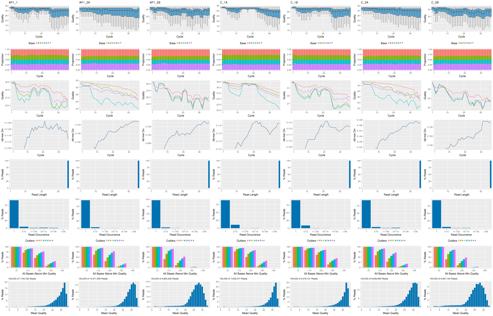

f--
title: ChIP-Seq Workflow Template 
author: "First/last name (first.last@ucr.edu)"
date: "Last update: 12 June, 2018" 
output:
  html_document:
    toc: true
    toc_float:
        collapsed: true
        smooth_scroll: true
    toc_depth: 3
    fig_caption: yes
    code_folding: show
    number_sections: true

fontsize: 14pt
bibliography: bibtex.bib
---

<!--
- Compile from command-line
Rscript -e "rmarkdown::render('systemPipeChIPseq.Rmd', c('html_document'), clean=F); knitr::knit('systemPipeChIPseq.Rmd', tangle=TRUE)"; Rscript ../md2jekyll.R systemPipeChIPseq.knit.md 13; Rscript -e "rmarkdown::render('systemPipeChIPseq.Rmd', c('pdf_document'))"
-->

<script type="text/javascript">
document.addEventListener("DOMContentLoaded", function() {
  document.querySelector("h1").className = "title";
});
</script>
<script type="text/javascript">
document.addEventListener("DOMContentLoaded", function() {
  var links = document.links;  
  for (var i = 0, linksLength = links.length; i < linksLength; i++)
    if (links[i].hostname != window.location.hostname)
      links[i].target = '_blank';
});
</script>


# Introduction

Users want to provide here background information about the design of their ChIP-Seq project.

## Background and objectives

This report describes the analysis of several ChIP-Seq experiments
studying the DNA binding patterns of the transcriptions factors ... from
*organism* ....

## Experimental design

Typically, users want to specify here all information relevant for the
analysis of their NGS study. This includes detailed descriptions of
FASTQ files, experimental design, reference genome, gene annotations,
etc.

# Generate workflow environment

Load workflow environment with sample data into your current working
directory. The sample data are described [here](http://www.bioconductor.org/packages/devel/bioc/vignettes/systemPipeR/inst/doc/systemPipeR.html#load-sample-data-and-workflow-templates).

In the workflow environments generated by `genWorkenvir` all data inputs are stored in
a `data/` directory and all analysis results will be written to a separate
`results/` directory, while the `systemPipeChIPseq.Rmd` script and the `targets` file are expected to be located in
the parent directory. The R session is expected to run from this parent
directory. Additional parameter files are stored under `param/`.

To work with real data, users want to organize their own data similarly
and substitute all test data for their own data. To rerun an established
workflow on new data, the initial `targets` file along with the corresponding
FASTQ files are usually the only inputs the user needs to provide.


```r
library(systemPipeRdata)
genWorkenvir(workflow="chipseq")
setwd("chipseq")
```

Alternatively, this can be done from the command-line as follows:


```sh
$ Rscript -e "systemPipeRdata::genWorkenvir(workflow='chipseq')"
$ cd chipseq
```

Now download the latest `systemPipeChIPseq.Rmd` script for this course. From
within R this can be done as follows.


```sh
download.file("https://raw.githubusercontent.com/tgirke/GEN242/gh-pages/_vignettes/12_ChIPseqWorkflow/systemPipeChIPseq.Rmd", "systemPipeChIPseq.Rmd")
```

Or from the command-line one can do this with `wget`.

```sh
$ wget -O systemPipeChIPseq.Rmd https://raw.githubusercontent.com/tgirke/GEN242/gh-pages/_vignettes/12_ChIPseqWorkflow/systemPipeChIPseq.Rmd
```

Now log in to a computer node on the HPCC/biocluser. The following command sequence will connect the user from the command-line to a computer node on the cluster. 


```r
$ srun --x11 --partition=short --mem=2gb --cpus-per-task 1 --ntasks 1 --time 2:00:00 --pty bash -l
```

Load desired R version from module system (here R-3.4.2).


```sh
$ module load R/3.4.2
```

Now open the R markdown script `systemPipeChIPseq.Rmd`in your R IDE (_e.g._ nvim-r or RStudio) and 
run the workflow as outlined below. 

Note, Tmux sessions should always run on one of the headnodes and never on the computer nodes themsleves.
This is important since Tmux sessions are persistent meaning they don't close automatically when a computer 
job finishes. Thus, they are not controlled by the queueing system. 

To check the environment of R session, one can execute the following commands from R. The first line
returns the node name of the R session.


```r
system("hostname") # should return name of a compute node starting with i or c 
getwd() # checks current working directory of R session
dir() # returns content of current working directory
```

## Required packages and resources

The `systemPipeR` package needs to be loaded to perform the analysis steps shown in
this report [@H_Backman2016-bt].


```r
library(systemPipeR)
```

If applicable users can load custom functions not provided by `systemPipeR`. Skip
this step if this is not the case.


```r
source("systemPipeChIPseq_Fct.R")
```

# Read preprocessing

## Experiment definition provided by `targets` file

The `targets` file defines all FASTQ files and sample comparisons of the analysis workflow.


```r
targets <- read.delim("targets_chip.txt", comment.char = "#")
targets
```

```
##                                                     FileName SampleName Factor       SampleLong
## 1 /bigdata/gen242/shared/ChIP-Seq1/data/SRR038845_1.fastq.gz      AP1_1    AP1 APETALA1 Induced
## 2 /bigdata/gen242/shared/ChIP-Seq1/data/SRR038846_1.fastq.gz     AP1_2A    AP1 APETALA1 Induced
## 3 /bigdata/gen242/shared/ChIP-Seq1/data/SRR038847_1.fastq.gz     AP1_2B    AP1 APETALA1 Induced
## 4 /bigdata/gen242/shared/ChIP-Seq1/data/SRR038848_1.fastq.gz       C_1A      C     Control Mock
## 5 /bigdata/gen242/shared/ChIP-Seq1/data/SRR038849_1.fastq.gz       C_1B      C     Control Mock
## 6 /bigdata/gen242/shared/ChIP-Seq1/data/SRR038850_1.fastq.gz       C_2A      C     Control Mock
## 7 /bigdata/gen242/shared/ChIP-Seq1/data/SRR038851_1.fastq.gz       C_2B      C     Control Mock
##   Experiment      Date SampleReference
## 1          1 23-Mar-12                
## 2          1 23-Mar-12                
## 3          1 23-Mar-12                
## 4          1 23-Mar-12           AP1_1
## 5          1 23-Mar-12           AP1_1
## 6          1 23-Mar-12          AP1_2A
## 7          1 23-Mar-12          AP1_2B
```

## Read quality filtering and trimming

The following example shows how one can design a custom read
preprocessing function using utilities provided by the `ShortRead` package, and then
apply it with `preprocessReads` in batch mode to all FASTQ samples referenced in the
corresponding `SYSargs` instance (`args` object below). More detailed information on
read preprocessing is provided in `systemPipeR's` main vignette.


```r
args <- systemArgs(sysma="param/trim.param", mytargets="targets_chip.txt")
filterFct <- function(fq, cutoff=20, Nexceptions=0) {
    qcount <- rowSums(as(quality(fq), "matrix") <= cutoff)
    fq[qcount <= Nexceptions] # Retains reads where Phred scores are >= cutoff with N exceptions
}
preprocessReads(args=args, Fct="filterFct(fq, cutoff=20, Nexceptions=0)", batchsize=100000)
writeTargetsout(x=args, file="targets_chip_trim.txt", overwrite=TRUE)
```

## FASTQ quality report

The following `seeFastq` and `seeFastqPlot` functions generate and plot a series of useful quality
statistics for a set of FASTQ files including per cycle quality box
plots, base proportions, base-level quality trends, relative k-mer
diversity, length and occurrence distribution of reads, number of reads
above quality cutoffs and mean quality distribution. The results are
written to a PDF file named `fastqReport.pdf`.


```r
args <- systemArgs(sysma="param/tophat.param", mytargets="targets_chip_trim.txt")
library(BiocParallel); library(BatchJobs)
f <- function(x) {
    library(systemPipeR)
    args <- systemArgs(sysma="param/tophat.param", mytargets="targets_chip.txt")
    seeFastq(fastq=infile1(args)[x], batchsize=100000, klength=8)
}
funs <- makeClusterFunctionsSLURM("slurm.tmpl")
param <- BatchJobsParam(length(args), resources=list(walltime="00:20:00", ntasks=1, ncpus=1, memory="2G"), cluster.functions=funs)
register(param)
fqlist <- bplapply(seq(along=args), f)
pdf("./results/fastqReport.pdf", height=18, width=4*length(fqlist)); seeFastqPlot(unlist(fqlist, recursive=FALSE)); dev.off()
png("./results/fastqReport.png", height=18, width=4*length(fqlist), units="in", res=300); seeFastqPlot(unlist(fqlist, recursive=FALSE)); dev.off()
```


<div align="center">Figure 1: FASTQ quality report for 18 samples</div></br>


# Alignments

## Read mapping with `Bowtie2` 

The NGS reads of this project will be aligned with `Bowtie2` against the
reference genome sequence [@Langmead2012-bs]. The parameter settings of the
aligner are defined in the `bowtieSE.param` file. In ChIP-Seq experiments it is
usually more appropriate to eliminate reads mapping to multiple locations. To
achieve this, users want to remove the argument setting `-k 50 non-deterministic` 
in the `bowtieSE.param` file.

The following submits 18 alignment jobs via a scheduler to a computer cluster.


```r
args <- systemArgs(sysma="param/bowtieSE.param", mytargets="targets_chip.txt")
sysargs(args)[1] # Command-line parameters for first FASTQ file
moduleload(modules(args)) # Skip if a module system is not used
system("bowtie2-build ./data/tair10.fasta ./data/tair10.fasta") # Indexes reference genome
resources <- list(walltime="1:00:00", ntasks=1, ncpus=cores(args), memory="10G")
reg <- clusterRun(args, conffile=".BatchJobs.R", template="slurm.tmpl", Njobs=18, runid="01",
                  resourceList=resources)
waitForJobs(reg)
writeTargetsout(x=args, file="targets_bam.txt", overwrite=TRUE)
```

Alternatively, one can run the alignments sequentially on a single system. 


```r
runCommandline(args)
```

Check whether all BAM files have been created

```r
file.exists(outpaths(args))
```

## Read and alignment stats

The following provides an overview of the number of reads in each sample
and how many of them aligned to the reference.


```r
read_statsDF <- alignStats(args=args) 
write.table(read_statsDF, "results/alignStats.xls", row.names=FALSE, quote=FALSE, sep="\t")
read.delim("results/alignStats.xls")
```

## Create symbolic links for viewing BAM files in IGV

The `symLink2bam` function creates symbolic links to view the BAM alignment files in a
genome browser such as IGV without moving these large files to a local
system. The corresponding URLs are written to a file with a path
specified under `urlfile`, here `IGVurl.txt`.


```r
symLink2bam(sysargs=args, htmldir=c("~/.html/", "somedir/"), 
            urlbase="http://biocluster.ucr.edu/~tgirke/", 
            urlfile="./results/IGVurl.txt")
```

# Utilities for coverage data

The following introduces several utilities useful for ChIP-Seq data. They are not part of the actual
workflow.

## Rle object stores coverage information

```r
library(rtracklayer); library(GenomicRanges); library(Rsamtools); library(GenomicAlignments)
aligns <- readGAlignments(outpaths(args)[1])
cov <- coverage(aligns)
cov

##Plotting chromosomes from cov
z <- GRanges("Chr5",IRanges(1,length(cov$Chr5)))
ynum <- as.numeric(cov$Chr5[ranges(z)])
png(file='chr5.png')
plot(ynum, type="l", col="blue", lwd=2)
dev.off()
```

## Resizing aligned reads

```r
trim(resize(as(aligns, "GRanges"), width = 200))
```

## Naive peak calling

```r
islands <- slice(cov, lower = 15)
islands[[1]]
```

## Plot coverage for defined region

```r
library(ggbio)
myloc <- c("Chr1", 1, 35000000)
ga <- readGAlignments(outpaths(args)[1], use.names=TRUE, param=ScanBamParam(which=GRanges(myloc[1], IRanges(as.numeric(myloc[2]), as.numeric(myloc[3])))))
pdf(file= 'test.pdf')
autoplot(ga, aes(color = strand, fill = strand), facets = strand ~ seqnames, stat = "coverage")
dev.off()
```

# Peak calling with MACS2

## Merge BAM files of replicates prior to peak calling

Merging BAM files of technical and/or biological replicates can improve
the sensitivity of the peak calling by increasing the depth of read
coverage. The `mergeBamByFactor` function merges BAM files based on grouping information
specified by a `factor`, here the `Factor` column of the imported targets file. It 
also returns an updated `SYSargs` object containing the paths to the
merged BAM files as well as to any unmerged files without replicates.
This step can be skipped if merging of BAM files is not desired.


```r
args <- systemArgs(sysma=NULL, mytargets="targets_bam.txt")
args_merge <- mergeBamByFactor(args, overwrite=TRUE)
writeTargetsout(x=args_merge, file="targets_mergeBamByFactor.txt", overwrite=TRUE)
```

## Peak calling without input/reference sample

MACS2 can perform peak calling on ChIP-Seq data with and without input
samples [@Zhang2008-pc]. The following performs peak calling without
input on all samples specified in the corresponding `args` object. Note, due to
the small size of the sample data, MACS2 needs to be run here with the
`nomodel` setting. For real data sets, users want to remove this parameter 
in the corresponding `*.param` file(s).

```{r call_peaks_macs_noref, eval=FALSEargs <- systemArgs(sysma="param/macs2_noinput.param", mytargets="targets_mergeBamByFactor.txt")
args <- systemArgs(sysma="param/macs2_noinput.param", mytargets="targets_mergeBamByFactor.txt")
sysargs(args)[1] # Command-line parameters for first FASTQ file
moduleload(module="python", envir=c("PATH", "LD_LIBRARY_PATH", "PYTHONPATH")) # Temp solution due to Python path change
moduleload(module="python")
runCommandline(args)

file.exists(outpaths(args))
writeTargetsout(x=args, file="targets_macs.txt", overwrite=TRUE)
```

### Peak calling with input/reference sample
#
#To perform peak calling with input samples, they can be most
#conveniently specified in the `SampleReference` column of the initial
#`targets` file. The `writeTargetsRef` function uses this information to create a `targets` 
#file intermediate for running MACS2 with the corresponding input samples.
#
#```{r call_peaks_macs_withref, eval=FALSE}
#writeTargetsRef(infile="targets_mergeBamByFactor.txt", outfile="targets_bam_ref.txt", silent=FALSE, overwrite=TRUE)
#args_input <- systemArgs(sysma="param/macs2.param", mytargets="targets_bam_ref.txt")
#sysargs(args_input)[1] # Command-line parameters for first FASTQ file
#unlink(outpaths(args_input)) # Note: if output exists then next line will not be run
#runCommandline(args_input)
#file.exists(outpaths(args_input))
#writeTargetsout(x=args_input, file="targets_macs_input.txt", overwrite=TRUE)
```

The peak calling results from MACS2 are written for each sample to
separate files in the `results` directory. They are named after the corresponding
files with extensions used by MACS2.


## Identify consensus peaks

The following example shows how one can identify consensus preaks among two peak sets sharing either a minimum absolute overlap and/or
minimum relative overlap using the `subsetByOverlaps` or `olRanges` functions, respectively. Note, the latter is
a custom function imported below by sourcing it.


```r
source("http://faculty.ucr.edu/~tgirke/Documents/R_BioCond/My_R_Scripts/rangeoverlapper.R")
peak_M1A <- outpaths(args)["AP1_1"]
peak_M1A <- as(read.delim(peak_M1A, comment="#")[,1:3], "GRanges")
peak_A1A <- outpaths(args)["C_1A"]
peak_A1A <- as(read.delim(peak_A1A, comment="#")[,1:3], "GRanges")
(myol1 <- subsetByOverlaps(peak_M1A, peak_A1A, minoverlap=1)) # Returns any overlap
myol2 <- olRanges(query=peak_M1A, subject=peak_A1A, output="gr") # Returns any overlap with OL length information
myol2[values(myol2)["OLpercQ"][,1]>=50] # Returns only query peaks with a minimum overlap of 50%
```

# Annotate peaks with genomic context

## Annotation with `ChIPpeakAnno` package

The following annotates the identified peaks with genomic context
information using the `ChIPpeakAnno` and `ChIPseeker` packages, respectively
[@Zhu2010-zo; @Yu2015-xu].


```r
library(ChIPpeakAnno); library(GenomicFeatures)
args <- systemArgs(sysma="param/annotate_peaks.param", mytargets="targets_macs_input.txt")
txdb <- loadDb("./data/TAIR10.sqlite")
#txdb <- makeTxDbFromGFF(file="data/tair10.gff", format="gff", dataSource="TAIR", organism="Arabidopsis thaliana")
#saveDb(txdb, file="./data/TAIR10.sqlite")
ge <- genes(txdb, columns=c("tx_name", "gene_id", "tx_type")) 
for(i in seq(along=args)) {
    peaksGR <- as(read.delim(infile1(args)[i], comment="#"), "GRanges")
    annotatedPeak <- annotatePeakInBatch(peaksGR, AnnotationData=genes(txdb))
    df <- data.frame(as.data.frame(annotatedPeak), as.data.frame(values(ge[values(annotatedPeak)$feature,])))
    write.table(df, outpaths(args[i]), quote=FALSE, row.names=FALSE, sep='\t')
}
writeTargetsout(x=args, file="targets_peakanno.txt", overwrite=TRUE)
```


The peak annotation results are written for each peak set to separate
files in the `results` directory. They are named after the corresponding peak
files with extensions specified in the `annotate_peaks.param` file, 
here `*.peaks.annotated.xls`.

## Annotation with `ChIPseeker` package

Same as in previous step but using the `ChIPseeker` package for annotating the peaks.


```r
library(ChIPseeker)
for(i in seq(along=args)) {
    peakAnno <- annotatePeak(infile1(args)[i], TxDb=txdb, verbose=FALSE)
    df <- as.data.frame(peakAnno)
    write.table(df, outpaths(args[i]), quote=FALSE, row.names=FALSE, sep="\t")
}
writeTargetsout(x=args, file="targets_peakanno.txt", overwrite=TRUE)
```

Summary plots provided by the `ChIPseeker` package. Here applied only to one sample
for demonstration purposes.


```r
peak <- readPeakFile(infile1(args)[1])
covplot(peak, weightCol="X.log10.pvalue.")
peakHeatmap(outpaths(args)[1], TxDb=txdb, upstream=1000, downstream=1000, color="red")
plotAvgProf2(outpaths(args)[1], TxDb=txdb, upstream=1000, downstream=1000, xlab="Genomic Region (5'->3')", ylab = "Read Count Frequency")
```

# Count reads overlapping peaks

The `countRangeset` function is a convenience wrapper to perform read counting
iteratively over serveral range sets, here peak range sets. Internally,
the read counting is performed with the `summarizeOverlaps` function from the 
`GenomicAlignments` package. The resulting count tables are directly saved to 
files, one for each peak set.


```r
library(GenomicRanges)
args <- systemArgs(sysma="param/count_rangesets.param", mytargets="targets_macs_input.txt")
args_bam <- systemArgs(sysma=NULL, mytargets="targets_bam.txt")
bfl <- BamFileList(outpaths(args_bam), yieldSize=50000, index=character())
countDFnames <- countRangeset(bfl, args, mode="Union", ignore.strand=TRUE)
writeTargetsout(x=args, file="targets_countDF.txt", overwrite=TRUE)
```

# Differential binding analysis

The `runDiff` function performs differential binding analysis in batch mode for
several count tables using `edgeR` or `DESeq2` [@Robinson2010-uk; @Love2014-sh].
Internally, it calls the functions `run_edgeR` and `run_DESeq2`. It also returns 
the filtering results and plots from the downstream `filterDEGs` function using 
the fold change and FDR cutoffs provided under the `dbrfilter` argument.


```r
args_diff <- systemArgs(sysma="param/rundiff.param", mytargets="targets_countDF.txt")
cmp <- readComp(file=args_bam, format="matrix") 
dbrlist <- runDiff(args=args_diff, diffFct=run_edgeR, targets=targetsin(args_bam), 
                    cmp=cmp[[1]], independent=TRUE, dbrfilter=c(Fold=0.75, FDR=.1))
writeTargetsout(x=args_diff, file="targets_rundiff.txt", overwrite=TRUE)
```


# GO term enrichment analysis

The following performs GO term enrichment analysis for each annotated peak set.

## Obtain gene-to-GO mappings


```r
library("biomaRt")
listMarts() # To choose BioMart database
listMarts(host="plants.ensembl.org")
m <- useMart("plants_mart", host="plants.ensembl.org")
listDatasets(m)
m <- useMart("plants_mart", dataset="athaliana_eg_gene", host="plants.ensembl.org")
listAttributes(m) # Choose data types you want to download
go <- getBM(attributes=c("go_id", "tair_locus", "namespace_1003"), mart=m)
go <- go[go[,3]!="",]; go[,3] <- as.character(go[,3])
go[go[,3]=="molecular_function", 3] <- "F"; go[go[,3]=="biological_process", 3] <- "P"; go[go[,3]=="cellular_component", 3] <- "C"
go[1:4,]
dir.create("./data/GO")
write.table(go, "data/GO/GOannotationsBiomart_mod.txt", quote=FALSE, row.names=FALSE, col.names=FALSE, sep="\t")
catdb <- makeCATdb(myfile="data/GO/GOannotationsBiomart_mod.txt", lib=NULL, org="", colno=c(1,2,3), idconv=NULL)
save(catdb, file="data/GO/catdb.RData")
```

## Run GO term enrichment analysis


```r
args <- systemArgs(sysma="param/macs2.param", mytargets="targets_bam_ref.txt")
args_anno <- systemArgs(sysma="param/annotate_peaks.param", mytargets="targets_macs_input.txt")
annofiles <- outpaths(args_anno)
gene_ids <- sapply(names(annofiles), function(x) unique(as.character(read.delim(annofiles[x])[,"geneId"])), simplify=FALSE)
load("data/GO/catdb.RData")
BatchResult <- GOCluster_Report(catdb=catdb, setlist=gene_ids, method="all", id_type="gene", CLSZ=2, cutoff=0.9, gocats=c("MF", "BP", "CC"), recordSpecGO=NULL)
```


# Motif analysis

## Parse DNA sequences of peak regions from genome

Enrichment analysis of known DNA binding motifs or _de novo_ discovery
of novel motifs requires the DNA sequences of the identified peak
regions. To parse the corresponding sequences from the reference genome,
the `getSeq` function from the `Biostrings` package can be used. The 
following example parses the sequences for each peak set and saves the 
results to separate FASTA files, one for each peak set. In addition, the 
sequences in the FASTA files are ranked (sorted) by increasing p-values 
as expected by some motif discovery tools, such as `BCRANK`.


```r
library(Biostrings); library(seqLogo); library(BCRANK)
args <- systemArgs(sysma="param/annotate_peaks.param", mytargets="targets_macs_input.txt")
rangefiles <- infile1(args)
for(i in seq(along=rangefiles)) {
    df <- read.delim(rangefiles[i], comment="#")
    peaks <- as(df, "GRanges")
    names(peaks) <- paste0(as.character(seqnames(peaks)), "_", start(peaks), "-", end(peaks))
    peaks <- peaks[order(values(peaks)$X.log10.pvalue., decreasing=TRUE)]
    pseq <- getSeq(FaFile("./data/tair10.fasta"), peaks)
    names(pseq) <- names(peaks)
    writeXStringSet(pseq, paste0(rangefiles[i], ".fasta")) 
}
```

## Motif discovery with `BCRANK`

The Bioconductor package `BCRANK` is one of the many tools available for 
_de novo_ discovery of DNA binding motifs in peak regions of ChIP-Seq
experiments. The given example applies this method on the first peak
sample set and plots the sequence logo of the highest ranking motif.


```r
set.seed(0)
BCRANKout <- bcrank(paste0(rangefiles[1], ".fasta"), restarts=25, use.P1=TRUE, use.P2=TRUE)
toptable(BCRANKout)
topMotif <- toptable(BCRANKout, 1)
weightMatrix <- pwm(topMotif, normalize = FALSE)
weightMatrixNormalized <- pwm(topMotif, normalize = TRUE)
pdf("results/seqlogo.pdf")
seqLogo(weightMatrixNormalized)
dev.off()
```


<div align="center">Figure 2: One of the motifs identified by `BCRANK`</div></br>


# Version Information


```r
sessionInfo()
```

```
## R version 3.5.0 (2018-04-23)
## Platform: x86_64-pc-linux-gnu (64-bit)
## Running under: CentOS Linux 7 (Core)
## 
## Matrix products: default
## BLAS: /usr/lib64/libblas.so.3.4.2
## LAPACK: /usr/lib64/liblapack.so.3.4.2
## 
## locale:
## [1] C
## 
## attached base packages:
## [1] stats4    parallel  stats     graphics  utils     datasets  grDevices methods   base     
## 
## other attached packages:
##  [1] ape_5.1                     ggplot2_2.2.1               BiocStyle_2.8.0            
##  [4] rtracklayer_1.40.0          systemPipeR_1.14.0          ShortRead_1.38.0           
##  [7] GenomicAlignments_1.16.0    SummarizedExperiment_1.10.0 DelayedArray_0.6.0         
## [10] matrixStats_0.53.1          Biobase_2.40.0              BiocParallel_1.14.0        
## [13] Rsamtools_1.32.0            Biostrings_2.48.0           XVector_0.20.0             
## [16] GenomicRanges_1.32.0        GenomeInfoDb_1.16.0         IRanges_2.14.1             
## [19] S4Vectors_0.18.1            BiocGenerics_0.26.0         nvimcom_0.9-28             
## [22] vimcom_1.3-1                setwidth_1.0-4              colorout_1.2-0             
## 
## loaded via a namespace (and not attached):
##  [1] nlme_3.1-137           Category_2.46.0        bitops_1.0-6           bit64_0.9-7           
##  [5] RColorBrewer_1.1-2     progress_1.1.2         httr_1.3.1             rprojroot_1.3-2       
##  [9] Rgraphviz_2.24.0       tools_3.5.0            backports_1.1.2        R6_2.2.2              
## [13] DBI_1.0.0              lazyeval_0.2.1         colorspace_1.3-2       prettyunits_1.0.2     
## [17] bit_1.1-12             compiler_3.5.0         sendmailR_1.2-1        graph_1.58.0          
## [21] scales_0.5.0           checkmate_1.8.5        BatchJobs_1.7          genefilter_1.62.0     
## [25] RBGL_1.56.0            stringr_1.3.0          digest_0.6.15          rmarkdown_1.10        
## [29] AnnotationForge_1.22.0 base64enc_0.1-3        pkgconfig_2.0.1        htmltools_0.3.6       
## [33] limma_3.36.0           rlang_0.2.0            RSQLite_2.1.1          BBmisc_1.11           
## [37] GOstats_2.46.0         hwriter_1.3.2          RCurl_1.95-4.10        magrittr_1.5          
## [41] GO.db_3.6.0            GenomeInfoDbData_1.1.0 Matrix_1.2-14          Rcpp_0.12.16          
## [45] munsell_0.4.3          stringi_1.2.2          yaml_2.1.19            edgeR_3.22.0          
## [49] zlibbioc_1.26.0        plyr_1.8.4             grid_3.5.0             blob_1.1.1            
## [53] lattice_0.20-35        splines_3.5.0          GenomicFeatures_1.32.0 annotate_1.58.0       
## [57] locfit_1.5-9.1         knitr_1.20             pillar_1.2.2           rjson_0.2.18          
## [61] codetools_0.2-15       biomaRt_2.36.0         XML_3.98-1.11          evaluate_0.10.1       
## [65] latticeExtra_0.6-28    data.table_1.11.0      gtable_0.2.0           assertthat_0.2.0      
## [69] xtable_1.8-2           survival_2.42-3        tibble_1.4.2           pheatmap_1.0.8        
## [73] AnnotationDbi_1.42.0   memoise_1.1.0          brew_1.0-6             GSEABase_1.42.0
```


# Funding

This project was supported by funds from the National Institutes of
Health (NIH) and the National Science Foundation (NSF).

# References

